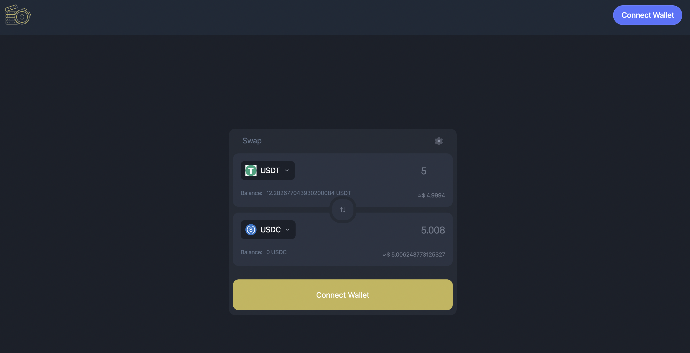
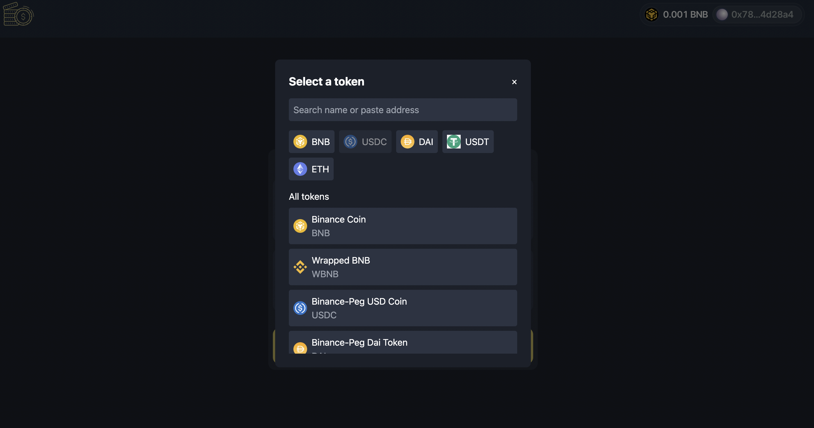
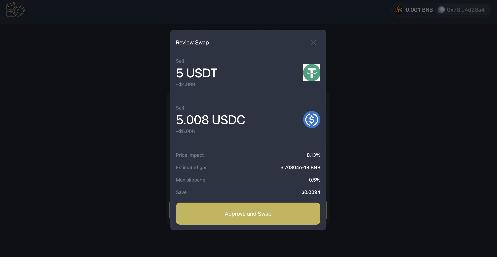
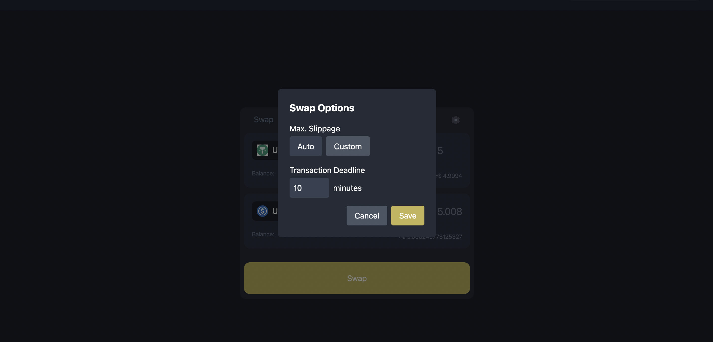

# Coin Swap

Welcome to the documentation for Coin Swap, enabling token swaps using OpenOcean V4. This guide provides comprehensive information on how to use the platform, including features, functionalities, and step-by-step instructions.

## Table of Contents

1. [Introduction](#introduction)
2. [Features](#features)
3. [Getting Started](#getting-started)
4. [User Interface Overview](#user-interface-overview)
5. [How to Swap Tokens](#how-to-swap-tokens)
6. [Advanced Settings](#advanced-settings)
7. [Troubleshooting](#troubleshooting)
8. [Contact and Support](#contact-and-support)

## Introduction

Our DEX platform leverages the power of OpenOcean V4 to provide seamless and efficient token swaps. Users can exchange a wide range of cryptocurrencies with ease, ensuring competitive rates and minimal slippage.

## Features

- **Token Swaps**: Easily swap between different tokens with real-time pricing.
- **Top Tokens**: Access a curated list of popular tokens for quick selection.
- **Customizable Settings**: Adjust slippage tolerance and transaction expiry time.
- **Real-Time Quotes**: Get real-time quotes for token swaps.
- **User-Friendly Interface**: Intuitive design for a smooth swapping experience.

## Getting Started

To get started with our DEX platform, follow these steps:

1. **Connect Your Wallet**: Ensure your wallet is connected to the platform.
2. **Select Tokens**: Choose the tokens you want to swap.
3. **Set Amount**: Enter the amount of tokens you wish to swap.
4. **Review and Confirm**: Review the swap details and confirm the transaction.

## User Interface Overview

### Swap Interface

The swap interface is designed to be user-friendly and intuitive. Key components include:

1. **From Token**: The token you want to swap from.
2. **To Token**: The token you want to swap to.
3. **Amount Input**: Enter the amount for the swap.
4. **Swap Button**: Initiate the swap process.
5. **Settings Icon**: Access advanced settings.

### Token Selection

Select tokens from a comprehensive list or choose from popular tokens for quick access.

### Swap Confirmation

Review the swap details, including the amount, slippage, and estimated output, before confirming the transaction.

## How to Swap Tokens

### Step-by-Step Guide

1. **Connect Your Wallet**

   - Ensure your wallet (e.g., MetaMask) is connected to the platform.

2. **Select the From Token**

   - Click on the token dropdown to select the token you want to swap from.

3. **Select the To Token**

   - Click on the token dropdown to select the token you want to swap to.

4. **Enter the Amount**

   - Input the amount of the from token you wish to swap.

5. **Review Swap Details**

   - Check the swap details, including the estimated amount of the to token you will receive.

6. **Initiate the Swap**

   - Click the `Swap` button to initiate the swap.

7. **Confirm the Transaction**
   - Confirm the transaction in your wallet to complete the swap.

## Advanced Settings

### Slippage Tolerance

Adjust the slippage tolerance to control the acceptable price difference during the swap.

### Transaction Expiry Time

Set the transaction expiry time to define how long the swap request remains valid.

## Troubleshooting

### Common Issues

1. **Transaction Fails**

   - Ensure you have sufficient funds and gas fees.
   - Check if the slippage tolerance is set appropriately.

2. **Unable to Connect Wallet**

   - Verify that your wallet is properly configured and connected.
   - Refresh the page and try reconnecting.

3. **Token Not Listed**
   - Ensure the token is supported by OpenOcean V4.
   - Check for any network or connection issues.

## Contact and Support

For further assistance, please contact me:

- **Email**: bernardnamangala@gmail.com
